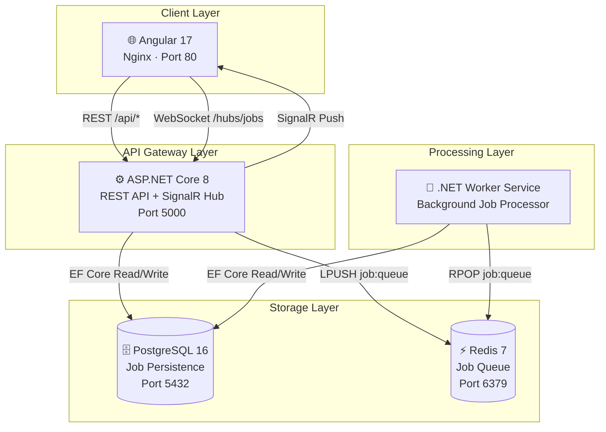
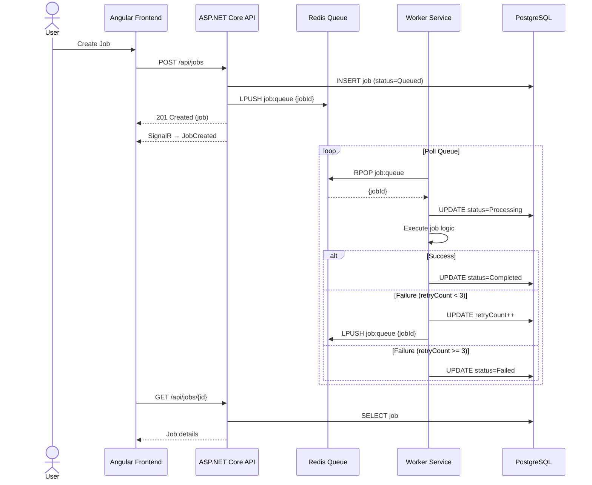
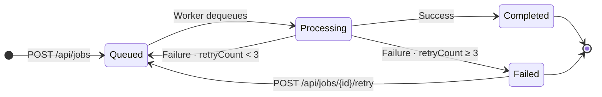
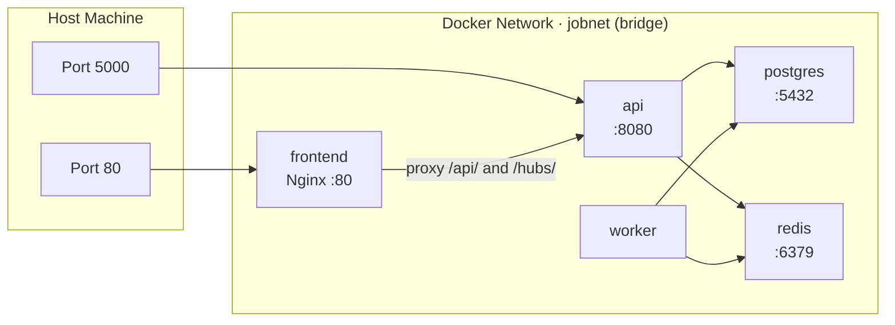
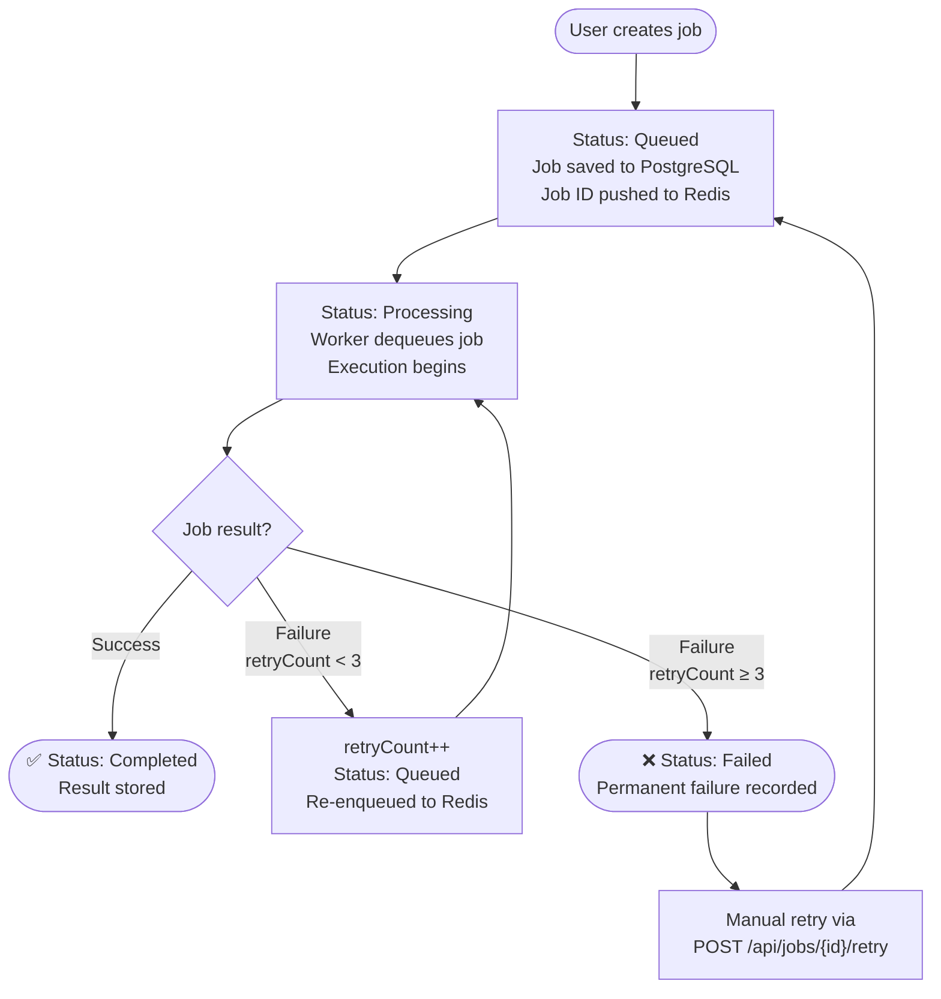
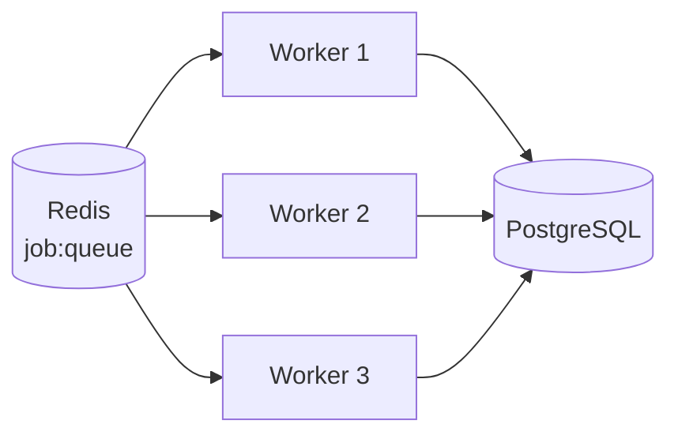

# Job Processing System

> A production-grade distributed job processing system built with .NET 8, Angular 17, PostgreSQL, Redis, and SignalR - fully containerized with Docker.

---

## Table of Contents

- [Architecture Overview](#architecture-overview)
- [Tech Stack](#tech-stack)
- [Project Structure](#project-structure)
- [Quick Start](#quick-start)
- [Service Details](#service-details)
- [API Reference](#api-reference)
- [Job Lifecycle](#job-lifecycle)
- [Real-time Updates](#real-time-updates)
- [Configuration](#configuration)
- [Scaling](#scaling)
- [Development Notes](#development-notes)

---

## Architecture Overview

### System Architecture



---

### Request Flow



---

### Job State Machine



---

### Docker Network Topology



---

## Tech Stack

| Layer | Technology | Version | Purpose |
|---|---|---|---|
| Frontend | Angular | 17 | SPA with reactive UI |
| Frontend Server | Nginx | 1.25 | Static hosting + reverse proxy |
| Backend API | ASP.NET Core | .NET 8 | REST API + SignalR hub |
| Worker | .NET Worker Service | .NET 8 | Background job processing |
| ORM | Entity Framework Core | 8.0 | Database access + migrations |
| Database | PostgreSQL | 16 | Persistent job storage |
| Queue | Redis | 7 | Distributed job queue |
| Real-time | SignalR | - | WebSocket push to clients |
| Logging | Serilog | - | Structured JSON logging |
| Containerization | Docker + Compose | - | Full system orchestration |

---

## Project Structure

```
job-processing-system/
├── docker-compose.yml
├── README.md
│
├── api/                              # ASP.NET Core Web API
│   ├── Dockerfile
│   ├── JobProcessing.Api.csproj
│   ├── Program.cs
│   ├── Controllers/
│   │   ├── JobsController.cs         # POST, GET, retry endpoints
│   │   └── HealthController.cs       # GET /health
│   ├── Services/
│   │   ├── IJobService.cs
│   │   └── JobService.cs             # Business logic
│   ├── Repositories/
│   │   ├── IJobRepository.cs
│   │   └── JobRepository.cs          # EF Core data access
│   ├── Models/
│   │   ├── Job.cs
│   │   ├── JobStatus.cs
│   │   └── DTOs/
│   ├── Data/
│   │   ├── AppDbContext.cs
│   │   └── Migrations/               # Auto-applied on startup
│   ├── Queue/
│   │   └── RedisJobQueue.cs          # LPUSH to Redis
│   └── Hubs/
│       └── JobHub.cs                 # SignalR hub
│
├── worker/                           # .NET Worker Service
│   ├── Dockerfile
│   ├── JobProcessing.Worker.csproj
│   ├── Program.cs
│   ├── Workers/
│   │   └── JobWorker.cs              # BackgroundService loop
│   ├── Services/
│   │   └── JobProcessorService.cs    # Job execution logic
│   ├── Repositories/
│   │   └── JobRepository.cs
│   ├── Data/
│   │   └── AppDbContext.cs
│   └── Queue/
│       └── RedisJobQueue.cs          # RPOP from Redis
│
└── frontend/                         # Angular 17 SPA
    ├── Dockerfile
    ├── nginx.conf                     # Reverse proxy config
    ├── src/
    │   └── app/
    │       ├── models/                # TypeScript interfaces
    │       ├── services/              # HTTP + SignalR services
    │       ├── pages/
    │       │   ├── dashboard/         # Stats overview
    │       │   ├── job-list/          # All jobs table
    │       │   ├── job-detail/        # Single job view + retry
    │       │   └── create-job/        # Job creation form
    │       └── shared/
    │           └── components/
    │               └── status-badge/
    └── ...
```

---

## Quick Start

### Prerequisites

| Requirement | Version |
|---|---|
| Docker Desktop | 24+ |
| Available Port | 80 (frontend) |
| Available Port | 5000 (API) |

> No Node.js, .NET SDK, or local database required. Everything runs in Docker.

### Run the System

```bash
# Clone the repository
git clone https://github.com/yashng7/job-processing-system
cd job-processing-system

# Build and start all services
docker compose up --build
```

That's it. Docker will:

1. Pull base images (postgres, redis, nginx, dotnet, node)
2. Build the API, Worker, and Angular app
3. Apply database migrations automatically
4. Start all services on the internal Docker network

### Access the System

| Service | URL |
|---|---|
| Frontend (Angular) | http://localhost |
| REST API | http://localhost:5000 |
| Health Check | http://localhost:5000/health |

### Stop the System

```bash
# Stop and remove containers
docker compose down

# Stop and remove containers + volumes (clears database)
docker compose down -v
```

---

## Service Details

### API Service

- Runs on internal port `8080`, exposed as `5000` on host
- Applies EF Core migrations on startup before accepting traffic
- Exposes a SignalR hub at `/hubs/jobs`
- Pushes `JobCreated` and `JobUpdated` events to all connected clients
- Uses clean architecture: Controller → Service → Repository

### Worker Service

- Runs as a `BackgroundService` with no exposed port
- Polls Redis every 1 second using `RPOP job:queue`
- On dequeue: sets status to `Processing`, executes job, updates result
- Retry logic: re-enqueues with `LPUSH` up to 3 total attempts
- After 3 failures: marks job as `Failed` permanently
- Scoped DI per job to ensure clean database contexts

### Frontend (Angular + Nginx)

- Built with Angular 17 standalone components and lazy-loaded routes
- Nginx serves the static build and proxies `/api/` and `/hubs/` to the API
- SignalR connection established on app init, auto-reconnects on disconnect
- Falls back gracefully if SignalR is unavailable

### PostgreSQL

- Persists all job records
- Schema managed by EF Core migrations (auto-applied)
- Data persisted in a named Docker volume `postgres_data`

### Redis

- Acts as a FIFO queue using `LPUSH` (enqueue) and `RPOP` (dequeue)
- Queue key: `job:queue`
- No persistence configured (queue is ephemeral by design)

---

## API Reference

### `POST /api/jobs`

Create and enqueue a new job.

**Request**
```bash
curl -X POST http://localhost:5000/api/jobs \
  -H "Content-Type: application/json" \
  -d '{
    "name": "Send Welcome Email",
    "payload": "{\"to\": \"user@example.com\", \"template\": \"welcome\"}"
  }'
```

**Response** `201 Created`
```json
{
  "id": "3fa85f64-5717-4562-b3fc-2c963f66afa6",
  "name": "Send Welcome Email",
  "status": "Queued",
  "payload": "{\"to\": \"user@example.com\", \"template\": \"welcome\"}",
  "result": null,
  "retryCount": 0,
  "createdAt": "2024-01-15T10:30:00Z",
  "updatedAt": "2024-01-15T10:30:00Z"
}
```

---

### `GET /api/jobs`

List all jobs ordered by creation date descending.

**Request**
```bash
curl http://localhost:5000/api/jobs
```

**Response** `200 OK`
```json
[
  {
    "id": "3fa85f64-5717-4562-b3fc-2c963f66afa6",
    "name": "Send Welcome Email",
    "status": "Completed",
    "payload": "{\"to\": \"user@example.com\"}",
    "result": "Job completed successfully at 2024-01-15T10:30:05Z",
    "retryCount": 0,
    "createdAt": "2024-01-15T10:30:00Z",
    "updatedAt": "2024-01-15T10:30:05Z"
  }
]
```

---

### `GET /api/jobs/{id}`

Get details for a specific job by ID.

**Request**
```bash
curl http://localhost:5000/api/jobs/3fa85f64-5717-4562-b3fc-2c963f66afa6
```

**Response** `200 OK`
```json
{
  "id": "3fa85f64-5717-4562-b3fc-2c963f66afa6",
  "name": "Send Welcome Email",
  "status": "Failed",
  "payload": "{\"to\": \"user@example.com\"}",
  "result": "Job permanently failed after 3 attempts. Last error: Simulated failure",
  "retryCount": 3,
  "createdAt": "2024-01-15T10:30:00Z",
  "updatedAt": "2024-01-15T10:30:20Z"
}
```

**Error** `404 Not Found`
```json
{ "message": "Job 3fa85f64-5717-4562-b3fc-2c963f66afa6 not found." }
```

---

### `POST /api/jobs/{id}/retry`

Re-queue a failed job for processing.

**Request**
```bash
curl -X POST http://localhost:5000/api/jobs/3fa85f64-5717-4562-b3fc-2c963f66afa6/retry
```

**Response** `200 OK`
```json
{
  "jobId": "3fa85f64-5717-4562-b3fc-2c963f66afa6",
  "message": "Job has been queued for retry."
}
```

**Error — Job Not Failed**
```json
{
  "jobId": "3fa85f64-5717-4562-b3fc-2c963f66afa6",
  "message": "Job cannot be retried. Current status: Processing"
}
```

---

### `GET /health`

Check API health status.

**Request**
```bash
curl http://localhost:5000/health
```

**Response** `200 OK`
```json
{
  "status": "healthy",
  "timestamp": "2024-01-15T10:30:00Z"
}
```

---

## Job Lifecycle



### Status Definitions

| Status | Meaning |
|---|---|
| `Queued` | Job created and waiting in Redis queue |
| `Processing` | Worker has picked up the job and is executing |
| `Completed` | Job finished successfully, result stored |
| `Failed` | Job exceeded max retries, manual intervention needed |

---

## Real-time Updates

The frontend connects to the SignalR hub at `/hubs/jobs` on application startup.

### Events

| Event | Trigger | Payload |
|---|---|---|
| `JobCreated` | `POST /api/jobs` succeeds | Full `JobResponse` object |
| `JobUpdated` | Worker updates job status | Full `JobResponse` object |

### Connection Behavior

- Auto-reconnects with backoff: `0ms → 2s → 5s → 10s`
- Connection indicator shown in sidebar (`Live` / `Offline`)
- All pages react to real-time events without manual refresh

---

## Configuration

### Environment Variables

**API Service**

| Variable | Description | Example |
|---|---|---|
| `ConnectionStrings__DefaultConnection` | PostgreSQL connection string | `Host=postgres;Port=5432;Database=jobprocessing;Username=jobuser;Password=jobpassword` |
| `Redis__ConnectionString` | Redis host and port | `redis:6379` |
| `Cors__AllowedOrigins` | Comma-separated allowed origins | `http://localhost,http://frontend` |
| `ASPNETCORE_ENVIRONMENT` | Runtime environment | `Production` |
| `ASPNETCORE_URLS` | Binding URL | `http://+:8080` |

**Worker Service**

| Variable | Description | Example |
|---|---|---|
| `ConnectionStrings__DefaultConnection` | PostgreSQL connection string | `Host=postgres;Port=5432;Database=jobprocessing;Username=jobuser;Password=jobpassword` |
| `Redis__ConnectionString` | Redis host and port | `redis:6379` |
| `DOTNET_ENVIRONMENT` | Runtime environment | `Production` |

> All values are set in `docker-compose.yml`. Service names (`postgres`, `redis`) resolve automatically within the Docker bridge network.

---

## Scaling

### Scale Worker Horizontally

Run multiple worker instances to increase job throughput:

```bash
# Run 3 worker instances in parallel
docker compose up --build --scale worker=3
```

Each worker instance independently polls the Redis queue. Redis `RPOP` is atomic, ensuring each job is processed by exactly one worker — no duplicate processing.



### Throughput Considerations

| Workers | Concurrent Jobs |
|---|---|
| 1 | 1 |
| 3 | 3 |
| 5 | 5 |
| N | N |

---

## Development Notes

### Viewing Logs

```bash
# All services
docker compose logs -f

# Specific service
docker compose logs -f api
docker compose logs -f worker
docker compose logs -f frontend
```

### Rebuilding a Single Service

```bash
docker compose up --build api
docker compose up --build worker
docker compose up --build frontend
```

### Connecting to PostgreSQL

```bash
docker exec -it jobprocessing_postgres psql -U jobuser -d jobprocessing
```

```sql
SELECT id, name, status, "retryCount", "createdAt" FROM "Jobs" ORDER BY "createdAt" DESC;
```

### Inspecting Redis Queue

```bash
docker exec -it jobprocessing_redis redis-cli

# Check queue length
LLEN job:queue

# Peek at queued job IDs
LRANGE job:queue 0 -1
```

### Reset Everything

```bash
# Remove all containers, networks, and data volumes
docker compose down -v --remove-orphans
docker compose up --build
```
